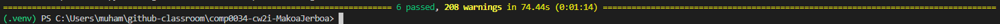

# Coursework 1 Markdown

## Link to Repository
https://github.com/ucl-comp0035/comp0034-cw2i-MakoaJerboa

## Usage
### Create Virtual Enviroment
In the terminal, type "py -m venv .venv" for Windows or "python3 -m venv .venv" for Unix/macOS (without the quotes)

### Activate Virtual Environment
If your IDE does not prompt you to activate the virtual environment, type ".venv\Scripts\activate" into the terminal for Windows or "source env/bin/activate" for Unix/macOS (without the quotes). Then close the terminal and open a new one, the virtual environment should now be active.

### Installing Requirements
In the terminal type "pip install -r requirements.txt"

### Run
The code can be run by running coursework2_dash.py

### Function
The terminal will show the link to the webapp. The web app has two bar graphs that can be interacted with by clicking on the various buttons at the top or dragging to zoom in on different parts of the graph. Each bar graph also has a dropdown to control which worker hour bands will be shown, multiple options can be selected to show multiple bands at once . The two pie charts have tradtional dropdowns where one option can be selected for each of them.

## Testing
All tests ran successfully. In the testing, both bar chart tests use the same option from the dropdown. This is because selenium opens a small chrome window and the top option was always visible, making it the most reliable option to test.

## References
### Use of AI
Github Copilot was used for autocomplete and debugging some errors.